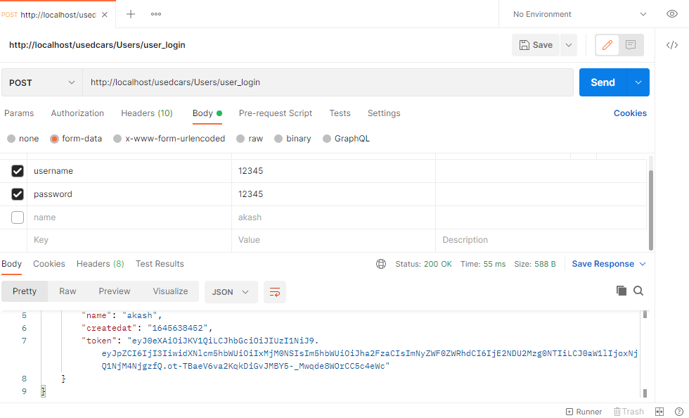

# used cars listing

### Screenshots

---

### How to install ?

## Codeigniter 3 is used to develop the project

1. Install wamp/xampp server and configure it on your system

2. Download zip file, extract to htdocs in xampp, and to www in wamp

3. create database named 'usedcars_db'

4. After creating the database, import 'usedcars_db.sql'

5. The database backup file can be found in the unzipped folder.

6. make necessary changes application/config/config.php and application/config/database files (if applicable).

7. Rename project folder to 'usedcars' (you can name it whatever you want).

8. By typing 'http://localhost/usedcars/' into the address bar, the home page will load.

## REST API in Codeigniter with token based authentication.

1. Create post method from postman for register new user "http://localhost/usedcars/Users/user_register"

   method:post
   form data required:
   ( username,password,name)

2. Create get method from postman for fetch all users "http://localhost/usedcars/Users/fetch_all_users"

   method:Get

3. Create post method from postman for login "http://localhost/usedcars/Users/user_login"

   method:post
   form data required:
   (username, password)
